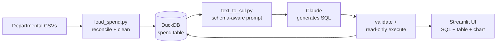

# Spend Ledger — Chat With Your Spend Data

A natural-language analytics tool over UK central-government spending. Ask a
plain-English question — *"which suppliers were paid by both departments?"* —
and the app generates validated SQL, runs it against a local analytical
database, and returns a table and chart, **showing the exact query that
produced every answer.**

Built with Python, DuckDB, Streamlit, and the Anthropic API. The dataset is
published departmental spend over £25,000 (Open Government Licence).

---

## Why this project

Public-spending data is open, but it isn't *accessible* — answering a simple
question means downloading dozens of inconsistent CSVs, reconciling them, and
writing SQL. This tool collapses that to a sentence, while keeping the result
auditable: the generated SQL is shown alongside every answer, so nothing is a
black box.

It's also a deliberate exercise in the parts of data engineering that don't
show up in a tidy demo: reconciling messy real-world schemas, putting
guardrails around an LLM, and being honest about a dataset's limits.

---

## What's in the data

| | |
|---|---|
| Departments | DfT (Transport), DESNZ (Energy) |
| Transactions | 40,131 payments over £25k |
| Total value | £64.0bn (gross transactional) |
| Coverage | Jul 2024 – Jan 2026 |

Per department:

- **DfT** — 33,272 rows · £48.2bn · Jan 2025 – Jan 2026
- **DESNZ** — 6,859 rows · £15.8bn · Jul 2024 – Sep 2025

> **A note on the figures.** These are *gross transactional* totals — every
> payment over £25k, including transfers between public bodies and to
> arm's-length organisations — not net departmental budgets. They are larger
> than budgets and should be read as transaction flow. The two departments'
> coverage windows differ, so any cross-department comparison is restricted to
> the overlapping period (Jan – Sep 2025).

---

## Architecture



Three modules, cleanly separated:

- **`load_spend.py`** — ingestion and schema reconciliation into DuckDB.
- **`text_to_sql.py`** — the natural-language-to-SQL engine (importable; also a
  standalone CLI).
- **`app.py`** — the Streamlit front end, which *imports* the engine rather than
  duplicating it.

---

## How it works

### 1. Schema reconciliation (the hard part)

Every department publishes the same conceptual data under different column
names, encodings, and formats. The loader normalises all of it into one
canonical schema:

- **Header reconciliation** — a synonym map collapses variants
  (`Amount` / `Amount (£)` / `AP Amount`, `Date` / `Date of Payment`, etc.)
  onto canonical columns.
- **Headerless amount recovery** — one source file ships its amount column with
  an unusable header. The loader scores every unmatched column and recovers the
  amount by a money heuristic (≥80% of values parse as numbers *and* median
  magnitude ≥ £1,000), which transaction references and postcodes can't satisfy.
- **Encoding + junk rows** — tries UTF-8, falls back to latin-1, and scans the
  first lines to find the real header beneath any title row.
- **Cleaning** — strips `£`/commas, treats `(500)` as negative, parses mixed
  date formats, and reads the department from the folder rather than an
  unreliable column.

### 2. Text-to-SQL with guardrails

- **Live schema introspection** — the prompt is built from the *actual* DuckDB
  schema at startup, plus low-cardinality value hints (so the model filters on
  the real codes `dft`/`desnz`, not `'DfT'`).
- **Read-only execution** — queries run on a `read_only=True` connection, so the
  database cannot be modified regardless of what SQL is produced.
- **Validation gate** — single statement, must begin with `SELECT`/`WITH`.
- **Self-correction** — if a query errors, the error is fed back to the model
  once to fix itself, which absorbs the occasional dialect slip.

### 3. Transparent UI

Every answer shows the generated SQL as an audit trail, then the results table,
then an auto-selected chart (time series → multi-line by department, rankings →
bar). Data provenance and the gross-vs-net caveat are permanently visible in the
sidebar.

---

## A result worth highlighting

Asked *"compare total spend by department for the period where both departments
have data,"* the model was **not** given the coverage dates. It wrote a query
that computed each department's date bounds and intersected them
(`MAX(min_date)` … `MIN(max_date)`) to derive the common window itself, then
compared on a like-for-like basis:

- Over the overlapping Jan – Sep 2025 window: **DfT £30.0bn vs DESNZ £9.2bn**
  (~3:1).

The top supplier across both departments is Network Rail (£10.3bn) — a
reminder that much of this spend is flow between public bodies, not payments to
private vendors.

---

## Tech stack

- **Python** — pandas for reconciliation and cleaning
- **DuckDB** — fast embedded analytical database; read-only at query time
- **Anthropic API** (Claude) — natural-language-to-SQL generation
- **Streamlit + Altair** — UI and charting

---

## Running it locally

```bash
# 1. Environment
pip install duckdb pandas anthropic streamlit altair
export ANTHROPIC_API_KEY=sk-ant-...

# 2. Place departmental CSVs under data/raw/<dept>/  e.g. data/raw/dft/

# 3. Build the database
python load_spend.py --raw ./data/raw --db ./spend.duckdb

# 4a. Ask from the command line
python text_to_sql.py -q "top 10 suppliers by total spend"

# 4b. or launch the web app
streamlit run app.py
```

---

## Engineering notes

**Isolating a framework bug.** The multi-department chart initially rendered as
one weaving line instead of two. The data and the SQL were correct, so the chart
logic was rendered to a static file *outside* Streamlit to remove the framework
and browser from the picture — confirming the data layer was sound. The cause
was a dtype check: DuckDB returns Arrow-backed strings whose dtype is not the
legacy pandas `object`, so the category column went undetected and the series
split silently collapsed. Detecting *any* non-numeric, non-datetime column fixed
it. A good reminder that "the data is fine" and "the chart is fine" are separate
claims worth verifying separately.

---

## Limitations & next steps

- **Two departments.** The pipeline is built to scale to more; adding a
  department is a folder of CSVs plus any new header synonyms.
- **Differing coverage windows.** Cross-department comparison is only valid over
  the overlap; the UI flags this rather than hiding it.
- **Gross transactional figures**, not net budgets — stated throughout.
- **Next:** supplier-name normalisation (entity resolution across spelling
  variants), and a results-caching layer to avoid re-querying identical
  questions.
